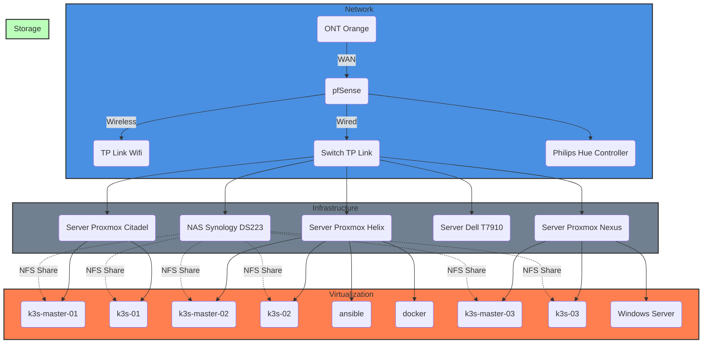

# Infrastructure

 This document outlines the infrastructure framework for a personal IT project, meticulously designed to ensure a blend of efficiency, scalability, and security. It represents the foundational architecture, encompassing network design, data management strategies, computational resources, and security protocols. 
 
 Aimed at supporting the project's unique requirements, this infrastructure is crafted to facilitate optimal performance, reliability, and adaptability, reflecting a commitment to leveraging advanced technologies and methodologies for achieving project objectives.


## Topology overview:





 ##  Network


- Description: The pfSense stands as a pivotal security gateway in the homelab setup, providing robust network protection, traffic management, and connectivity options. Tailored for efficient performance and reliability, this device is essential for maintaining a secure and efficient network environment.


###### Technical Specs:
-    *router pfSense: XCY X44*
-    CPU: Dual-core, supporting 1 package(s) x 2 core(s) configuration
-    RAM: 8GB, ensuring smooth operation of network services and applications
-    Storage: 120GB ZFS, offering reliable and resilient data storage capabilities
-    **Network Interfaces**:
```bash 
igb0: flags=8963<UP,BROADCAST,RUNNING,PROMISC,SIMPLEX,MULTICAST> metric 0 mtu 1500
        description: WAN
        options=4e120bb<RXCSUM,TXCSUM,VLAN_MTU,VLAN_HWTAGGING,JUMBO_MTU,VLAN_HWCSUM,WOL_MAGIC,VLAN_HWFILTER,RXCSUM_IPV6,TXCSUM_IPV6,NOMAP>
        ether 00:b5:13:fe:12:39
        inet X.X.X.X netmask 0xffffffc0 broadcast X.X.X.255
        media: Ethernet autoselect (1000baseT <full-duplex>)
        status: active
        nd6 options=23<PERFORMNUD,ACCEPT_RTADV,AUTO_LINKLOCAL>
igb1: flags=8863<UP,BROADCAST,RUNNING,SIMPLEX,MULTICAST> metric 0 mtu 1500
        description: LAN
        options=4e120bb<RXCSUM,TXCSUM,VLAN_MTU,VLAN_HWTAGGING,JUMBO_MTU,VLAN_HWCSUM,WOL_MAGIC,VLAN_HWFILTER,RXCSUM_IPV6,TXCSUM_IPV6,NOMAP>
        ether 00:a5:27:e0:2f:ba
        inet6 fe80::2a5:27ff:fee0:2fba%igb1 prefixlen 64 scopeid 0x2
        inet6 fe80::1:1%igb1 prefixlen 64 scopeid 0x2
        inet 192.168.57.1 netmask 0xffffff00 broadcast 192.168.57.255
        media: Ethernet autoselect (1000baseT <full-duplex>)
        status: active
        nd6 options=21<PERFORMNUD,AUTO_LINKLOCAL>
igb2: flags=8863<UP,BROADCAST,RUNNING,SIMPLEX,MULTICAST> metric 0 mtu 1500
        description: OPT1
        options=4e120bb<RXCSUM,TXCSUM,VLAN_MTU,VLAN_HWTAGGING,JUMBO_MTU,VLAN_HWCSUM,WOL_MAGIC,VLAN_HWFILTER,RXCSUM_IPV6,TXCSUM_IPV6,NOMAP>
        ether 00:a5:27:e0:2f:bb
        inet6 fe80::2a5:27ff:fee0:2fbb%igb2 prefixlen 64 scopeid 0x3
        inet 192.168.97.1 netmask 0xffffff00 broadcast 192.168.97.255
        media: Ethernet autoselect (1000baseT <full-duplex>)
        status: active
        nd6 options=21<PERFORMNUD,AUTO_LINKLOCAL>`

```


 ## Storage

 - The storage framework within this homelab is engineered for robustness, leveraging a mix of hardware and software to ensure data safety, performance, and scalability. Here's a concise overview of the storage configuration:

+++ Synology 

**NFS Share on Synology NAS**: Utilizing two HDDs in RAID1, this setup provides reliable, redundant storage, central to the Proxmox hypervisors for VM and essential data storage.

###### Key Features:
-    Model: Synology DS223
-    RAID: RAID1 for data safety
-    Function: Backup storage and NFS host for the homelab network.

```bash
admin@storage:~$ df -hTP
Filesystem        Type      Size  Used Avail Use% Mounted on
/dev/md0          ext4      7.9G  1.3G  6.5G  16% /
devtmpfs          devtmpfs  967M     0  967M   0% /dev
tmpfs             tmpfs     987M   68K  987M   1% /dev/shm
tmpfs             tmpfs     987M   19M  969M   2% /run
tmpfs             tmpfs     987M     0  987M   0% /sys/fs/cgroup
tmpfs             tmpfs     987M  1.2M  986M   1% /tmp
/dev/vg1/volume_1 btrfs     1.8T  461G  1.3T  26% /volume1
```

+++ Longhorn
Kubernetes Cluster Storage:
        Combines the Synology NAS NFS share for persistent storage and Longhorn for dynamic, scalable storage within the Kubernetes environment.
+++  Disks

**Proxmox Node Storage**:
        NVMe Drives (128GB): Host the Proxmox OS, ensuring quick system operations, with regular backups via Clonezilla for system recovery.
        SSD Storage (512GB): Employs ZFS replication for high availability and data integrity, supporting critical VMs and containers.

+++  Backup

**Backup Strategy**: Implements HyperBackup to C2 cloud storage for off-site backups, alongside RAID1 and Clonezilla for local redundancy and recovery..
+++


## Servers

+++ MiniPC
- Proxmox servers, when clustered, form a dynamic virtualization platform crucial for homelabs and IT infrastructures. These servers enable seamless management and deployment of virtual machines and containers, offering flexibility, scalability, and high availability for diverse workloads.

###### Specs per Mini PC:
-    DELL mini 3050
-    CPU: Intel Core i5-6500T @ 2.50GHz
-    RAM: 32GB DDR3
-    Storage: 128GB SSD + 512GB NVME
-    OS: Proxmox Hypervisor
- Cluster Composition: Three units operating in a Proxmox cluster for high availability and using ZFS replication for scalable storage.
###### Roles & VMs:
-    **citadel.merox.cloud**: k3s-master-01, k3s-worker-01
```bash
root@citadel:/home/merox# qm list
      VMID NAME                 STATUS     MEM(MB)    BOOTDISK(GB) PID
       103 kasm                 stopped    6144              64.00 0
       304 k3s-01               running    16384            125.20 179315
root@citadel:/home/merox# pct list
VMID       Status     Lock         Name
210        stopped                 lxc-k3s-ct-ready
301        running                 k3s-master-01
```
-    **helix.merox.cloud**: k3s-master-02, k3s-worker-02, docker on alto.merox.cloud, Ansible LXC
```bash
root@helix:~# qm list
      VMID NAME                 STATUS     MEM(MB)    BOOTDISK(GB) PID
       305 k3s-02               running    16384            125.20 376169
       800 ubuntu-cloud         stopped    4096              25.20 0
root@helix:~# pct list
VMID       Status     Lock         Name
100        running                 ansible
101        stopped                 cirrus
102        running                 alto
104        stopped                 cirrus.merox
302        running                 k3s-master-02
2000       stopped                 rke2-admin-template
```
-    **nexus.merox.cloud**: k3s-master-03, k3s-worker-03, Windows Server 2019
```bash
root@nexus:~# qm list
      VMID NAME                 STATUS     MEM(MB)    BOOTDISK(GB) PID
       105 winserver            running    4096              32.00 1218
       306 k3s-03               running    14336            125.20 1891
root@nexus:~# pct list
VMID       Status     Lock         Name
300        running                 k3s-admin
303        running                 k3s-master-03
```

+++ Tower
- Description: The **DELL T7910** tower serves as the heart of the homelab, running a Windows 11-based Kubernetes test cluster before deployment to the production cluster on the mini PCs. It's the powerhouse for virtualization and development.

###### *Technical Specs*:
-  DELL T7910
-  CPU: 2 x Intel Xeon E5-2667 v3 @ 3.20GHz
-  RAM: 64GB DDR3
-  Storage: 4TB SSD (2 x 2TB), 4TB HDD (2 x 2TB)
-  GPU: Nvidia Quadro K2000
-  OS: Windows 11

+++


## Monitoring


• **Expand the Use of Grafana**: You already utilize Grafana; consider integrating it further with Loki for a centralized logging solution. This combination allows for powerful visualization of logs alongside your metrics.

• **Leverage Loki for Comprehensive Logging**: Since Loki is in use, ensure it captures logs from all critical systems and services. Set up structured logging where possible to make searching and debugging more efficient.

• **Alerting and Anomaly Detection**: Utilize Prometheus' alerting rules to monitor for anomalies or specific events in your system metrics. For logging, configure Loki to alert on critical log patterns that could indicate issues or security concerns.

• **Netdata** ( K3S cluster) for Real-Time Performance Monitoring 📉: Utilize Netdata alongside existing tools for granular, real-time system monitoring.


 


## Security

  • **Firewall and IDS/IPS Enhancements**: With pfSense as your firewall, consider reviewing and updating your ruleset regularly to adapt to new threats. Enhance IDS/IPS capabilities by incorporating additional rule sets or integrating with external threat intelligence feeds for more dynamic protection.

   • **Secure Configuration Management**: Use Ansible for automated deployment of security updates and configuration changes. This ensures that all devices are consistently configured according to best security practices.
   
   • **VPN Security**: Ensure your VPN setup on pfSense uses strong encryption standards and regularly rotate keys to maintain secure remote access.


